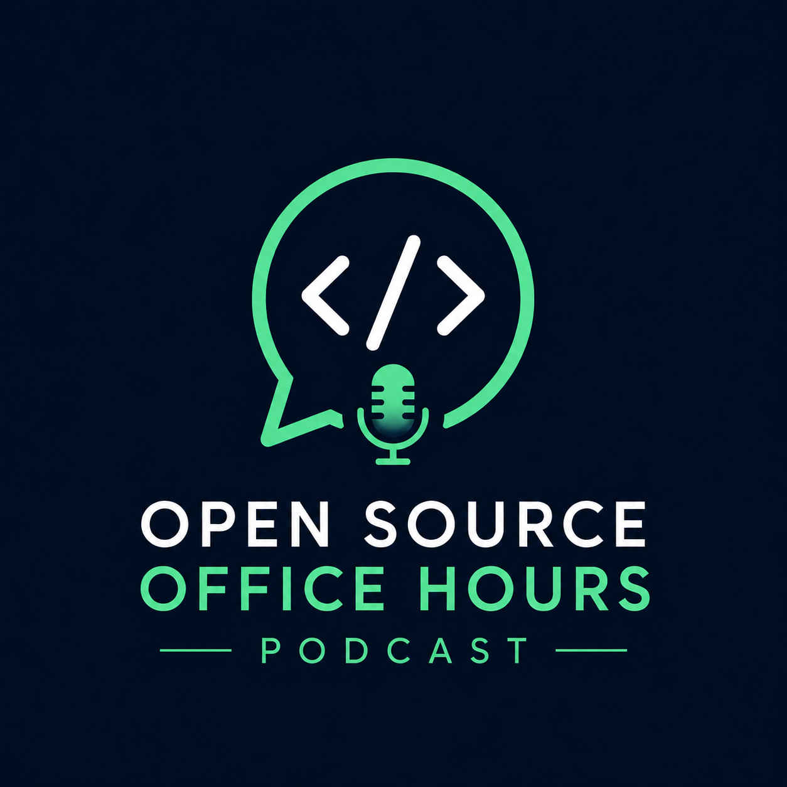

<p align="center">
  
</p>

# Open Source Office Hours

An automated weekly newsletter and podcast that picks a notable open-source project and produces a structured technical report at three difficulty levels (beginner, intermediate, advanced).

A Claude agent researches each project — cloning repos, reading source code, searching the web — then writes a report that gets saved to Firestore, converted to a podcast episode via Gemini TTS, emailed to subscribers, and published to a static site.

## Architecture

- **`functions/generate_report`** — Cloud Function (Pub/Sub triggered) that selects a project using Claude Haiku, runs a Claude Agent SDK research agent, generates podcast audio via Gemini TTS, saves the report to Firestore, and emails subscribers via Resend
- **`functions/api`** — Cloud Function (HTTP) providing subscribe/unsubscribe, report listing, RSS feed, and podcast feed endpoints
- **`frontend/`** — Static site templates, built via `scripts/build_frontend.py` and hosted on GitHub Pages
- **`config.yaml`** — Single source of truth for all branding, GCP settings, URLs, and podcast metadata
- **Cloud Scheduler** — Triggers report generation weekly (default: Mondays 7am PT)

## Setup

### Prerequisites

- Google Cloud project with these APIs enabled: Cloud Functions, Pub/Sub, Cloud Scheduler, Firestore, Secret Manager, Cloud Build, Cloud Run, Eventarc, Vertex AI
- [Resend](https://resend.com) account with a verified sender domain
- Anthropic API key
- GCS bucket for podcast audio (publicly readable)

### Configuration

All non-secret configuration lives in `config.yaml`:

| Key | Description |
|---|---|
| `name` | Brand name used in emails, feeds, prompts, and frontend |
| `tagline` | Hero tagline on the home page |
| `description` | Short description for RSS feed |
| `gcp_project` | GCP project ID |
| `gcp_region` | Deployment region |
| `site_url` | Public URL of the GitHub Pages site |
| `from_email` | Sender address for emails |
| `podcast_bucket` | GCS bucket for podcast episodes |
| `schedule` | Cron expression for weekly trigger |

### Secrets

Create a secret called `environment-variables` in GCP Secret Manager with:

```
ANTHROPIC_API_KEY=<your-key>
RESEND_API_KEY=<your-key>
UNSUBSCRIBE_SECRET=<random-hex>
ADMIN_EMAIL=<your-email>
```

Grant the default compute service account the `Secret Manager Secret Accessor` role on this secret.

### Deploy

```bash
bash deploy.sh
```

The frontend is deployed automatically via GitHub Pages on push to main. The build script (`scripts/build_frontend.py`) templates `{{PLACEHOLDER}}` tokens in the HTML/JS files using values from `config.yaml`.

### Manual trigger

```bash
gcloud pubsub topics publish open-source-office-hours-podcast-trigger \
  --message='{}' --project=open-source-office-hours-pod
```

## Roadmap

- [x] Podcast generation — TTS conversion of reports into audio episodes
- [x] Podcast RSS feed — iTunes-compliant feed for Apple Podcasts, Spotify, etc.
- [x] Audio player in the UI
- [x] Parallel TTS — Synthesize podcast sections concurrently
- [x] Config extraction — Single `config.yaml` for all non-secret configuration
- [x] Site header logo
- [x] Latest reports on home page
- [x] RSS feed (`/feed.xml`)
- [x] Error alerting — Email admin when report generation fails
- [x] Welcome email with most recent report
- [ ] Multi-domain support — Make topic selection and report prompts configurable templates for other domains
- [ ] Topic queue — Firestore-backed queue for manually requested episodes that get picked up before random selection
- [ ] Monetization — Explore podcast monetization (sponsorships, premium episodes, etc.)
