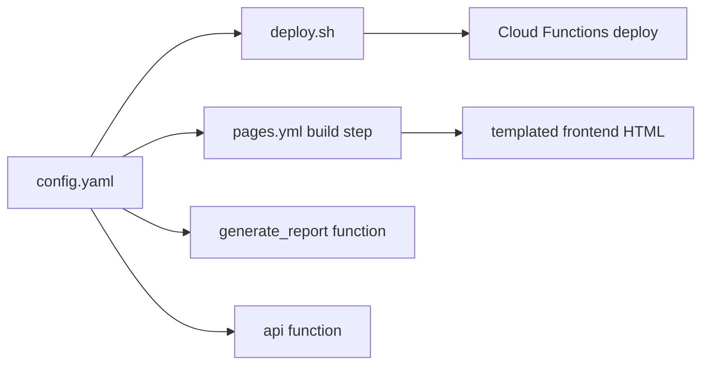

# Configuration Extraction

## Overview

Extract all hard-coded configuration (branding, GCP settings, URLs, podcast
metadata) from Python source, shell scripts, and HTML templates into a single
`config.yaml` at the repo root. This makes the project reusable for other
domains without editing application code.

## Architecture Boundaries & Flow Diagram



**Boundary:** `config.yaml` is read-only at deploy time and function startup.
It is NOT a runtime-mutable config store. Secrets remain in GCP Secret Manager
(`/etc/secrets/.env`), loaded as environment variables.

### What goes where

| Location | Contents |
| --- | --- |
| `config.yaml` | Branding, GCP IDs, URLs, podcast metadata, schedule |
| GCP Secret `.env` | `ANTHROPIC_API_KEY`, `RESEND_API_KEY`, etc. |

## Data Models (Critical)

No database schema changes. The only new file is `config.yaml`.

### `config.yaml` schema

```yaml
# Branding
name: "Weekly Deep Dive"
tagline: "One open-source project. Three levels of difficulty. Every week."
description: >-
  A weekly deep dive into notable open-source projects,
  explained at three levels of difficulty.

# GCP infrastructure
gcp_project: dev-deep-dive
gcp_region: us-central1
secret_name: environment-variables
topic: deep-dive-trigger
schedule: "0 7 * * MON"
timezone: America/Los_Angeles

# URLs & email
site_url: https://acham1.github.io/dev-deep-dive
from_email: deepdive@mail.dev-deep-dive.alanch.am

# Podcast
podcast_bucket: dev-deep-dive-podcast
podcast_cover_url: https://storage.googleapis.com/dev-deep-dive-podcast/cover.png
podcast_category: Technology
podcast_description: >-
  Each week, an AI agent researches a notable open-source project and
  produces a structured technical report at beginner, intermediate, and
  advanced levels. This podcast is the audio version of that report.
```

## API Contracts & Interfaces

No API changes. All existing endpoints remain identical.

### Python config loader

A shared `config.py` module in each function directory:

```python
import yaml

def load_config() -> dict:
    """Load config.yaml from the workspace root.
    In Cloud Functions, the source is deployed to /workspace.
    Locally, walk up from __file__ to find config.yaml.
    """
```

Returns the parsed YAML dict. Called once at module load time and cached.

### System prompts (`prompts.py`, `agent.py`, `podcast_generator.py`)

The selection prompt, report-writing system prompt, agent query, and podcast
intro/outro all contain hard-coded "Weekly Deep Dive" branding. After config
extraction:

- `SELECTION_PROMPT_TEMPLATE` becomes a constant with a `{name}` placeholder.
  `build_selection_prompt()` accepts `config` and interpolates `config["name"]`.
- `build_system_prompt()` accepts `config` and interpolates `config["name"]`
  and `config["description"]` into the writer persona.
- `agent.py` reads `config["name"]` for the query prompt string.
- `podcast_generator.py` reads `config["name"]` for the intro/outro lines in
  `build_podcast_script()`.

### Frontend build script

A `scripts/build_frontend.py` that:

1. Reads `config.yaml`
2. Derives `api_url` from `gcp_region` and `gcp_project`
3. For each `.html` file in `frontend/`, replaces `{{PLACEHOLDER}}` tokens
4. Writes output to `_site/`

### deploy.sh

Reads `config.yaml` via a small `yq` or Python one-liner to extract GCP
settings instead of hard-coding defaults.

## Dependencies

- `pyyaml` — already an implicit transitive dependency via `google-cloud-*`
  packages, but must be declared explicitly in both `requirements.txt` files.

No new third-party libraries beyond PyYAML.

## Security, Error Handling & Edge Cases

- `config.yaml` must NOT contain secrets. The `.env.example` documents which
  values belong in the GCP secret.
- If `config.yaml` is missing or malformed, functions should fail fast at
  import time with a clear error message.
- The frontend build script must fail if any `{{PLACEHOLDER}}` token remains
  unreplaced in the output, catching typos early.

## Observability

No new logging or metrics. Existing log lines remain unchanged — they just
read from config instead of hard-coded strings.

## Risks & Migration

- **Backward compatible:** Functions that currently read `os.environ.get()`
  with defaults will instead read from config. The env var overrides are
  removed since `config.yaml` is the single source of truth (secrets still
  come from env).
- **Frontend deploy path changes:** The workflow now builds into `_site/`
  before uploading, so the `paths` trigger should also include `config.yaml`.
- **deploy.sh requires `python3`:** Already available on any dev machine.
- **Rollback:** Revert the commit. No data migration.

## Testing Strategy

- Validate `config.yaml` loads correctly by running
  `python3 -c "import yaml; yaml.safe_load(open('config.yaml'))"`.
- Run `scripts/build_frontend.py` and verify no unreplaced `{{` tokens in
  output.
- Deploy both functions and verify the API returns reports and RSS feeds with
  correct branding.
- Trigger a test report and confirm email subjects and podcast feed metadata
  use values from config.

## Implementation Task Breakdown

- [ ] Create `config.yaml` at repo root with all extracted values
- [ ] Create `scripts/build_frontend.py` to template HTML from config
- [ ] Add `{{PLACEHOLDER}}` tokens to all 4 frontend HTML files
  (`index.html`, `report.html`, `archive.html`, `unsubscribe.html`) and
  `app.js`
- [ ] Update `.github/workflows/pages.yml` to run the build script and deploy
  `_site/` instead of `frontend/`; trigger on `config.yaml` changes too
- [ ] Create shared `config.py` loader in `functions/generate_report/`
- [ ] Copy `config.py` to `functions/api/` (each function is deployed
  independently with its own source)
- [ ] Update `functions/generate_report/` modules to use config:
  `main.py`, `email_sender.py`, `email_template.py`
- [ ] Templatize system prompts: replace hard-coded "Weekly Deep Dive" in
  `prompts.py` (`SELECTION_PROMPT_TEMPLATE`, `build_system_prompt`),
  `agent.py` (query string), and `podcast_generator.py` (intro/outro) with
  `config["name"]`
- [ ] Update `functions/api/` modules to use config:
  `feed.py`, `podcast_feed.py`, `welcome_email.py`
- [ ] Update `deploy.sh` to read `config.yaml` for GCP project, region,
  topic, secret name, schedule, and env vars
- [ ] Update `.env.example` to remove values now in `config.yaml` (keep only
  secrets)
- [ ] Copy `config.yaml` into each function's source directory in `deploy.sh`
  before deploying (Cloud Functions only uploads the source dir)
- [ ] Run `black` on all modified Python files
- [ ] Verify build, deploy, and end-to-end flow
